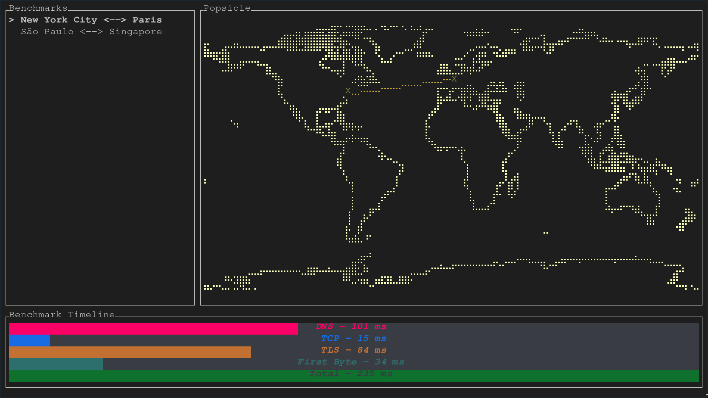

# Popsicle

Deploy and run PoP (Points of Presence) profilers around the world to see what latency your users in that region experience.

### Features

- [Profiler](./profiler/)
  - Asynchronous web server profiling library that supports concurrent requests.
  - Benchmarks time to resolve DNS, establish tcp connection, perform tls handshake, and recieve first byte.
- [Lambda Function](./lambda-function/)
  - Build and package Rust Lambda HTTP service to expose profiler
  - Deploy to several regions with 1 command using Terraform
  - Don't pay anything for having profiler's available at several locations
- [TUI](./tui/) (Work in progress)
  - Query a list of deployed profilers
  - See what regions (PoP) respond to your profile node
  - Benchmark timeline broken down in a graph to easily tell which parts take the longest
  - Output results in JSON, flamegraph, or plotted percentiles ?

### Setup

This repo contains a Rust crate (Profiler), Rust HTTP service for AWS Lambda runtime, and a TUI.

To starting using Popsicle, you need to deploy the HTTP service to AWS Lambda regions so you can than query them. Look at the [lambda-function](./lambda-function/#deploying) docs which also contains how you can run a a profile.

### TUI (Work in progress)

Browse through the benchmarks in an interactive terminal UI that displays locations of PoP that responded to your deployed profilers running on AWS Lambda. Breaks down timeline into visual graph.

See [TUI](./tui/) for more.
